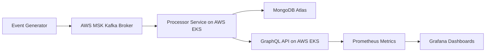

# Real-Time Ride-Sharing Analytics on AWS

A real-time analytics system for ride-sharing events built with **Kafka (MSK)**, **MongoDB Atlas**, **FastAPI/GraphQL**, **Prometheus**, and **Grafana**, deployed on **AWS**.

---

## 🚀 Features

- **Real-time event streaming** via AWS MSK.
- **Kafka Streams processing**: Consume events, aggregate metrics, and store in MongoDB Atlas.
- **GraphQL API**: Query city-level ride metrics and total ride statistics.
- **Monitoring & Observability**: Track API request counts and latency with Prometheus and Grafana.
- **Cloud-Ready Architecture**: Handles 100K+ ride events/day with <200ms latency.

---

## 🏗 AWS Architecture



[Event Generator] --> Kafka --> [Processor] --> MongoDB
                                          |
                                          v
                                    [GraphQL API]
                                          |
                                          v
                               [Prometheus Metrics] --> [Grafana Dashboards]

Event Generator: Produces simulated ride events.
AWS MSK: Managed Kafka streaming for high throughput.
Processor Service on AWS EKS: Consumes Kafka events, aggregates, and updates MongoDB Atlas.
MongoDB Atlas: Stores city-wise ride metrics (rides, revenue) in the cloud.
GraphQL API on AWS EKS: Exposes aggregated metrics.
Prometheus & Grafana: Monitor API performance and visualize metrics.


## ⚙️ Setup for Local Development
Note: AWS services are used in production. For local testing, Docker Compose is used.


# Clone the repository and start the project using Docker Compose:

```bash
git clone <your-repo-url>
cd real-time-ride-sharing-analytics
```

# Run with Docker Compose
```bash
docker-compose up -d
```

-Producers: Send events to Kafka.
-Processors: Consume and aggregate events.
-MongoDB: Stores processed metrics.
-API: GraphQL endpoint for queries.
-Prometheus & Grafana: Monitoring dashboards.


# Access Services

- **GraphQL API**: http://localhost:8000/graphql
- **Prometheus**: http://localhost:9090
- **Grafana**: http://localhost:3000
