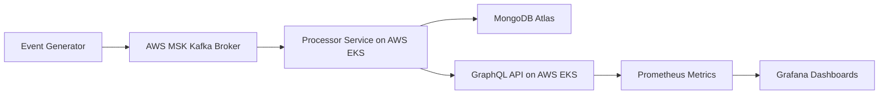

# Real-Time Ride-Sharing Analytics on AWS

A real-time analytics system for ride-sharing events built with **Kafka (MSK)**, **MongoDB Atlas**, **FastAPI/GraphQL**, **Prometheus**, and **Grafana**, deployed on **AWS**.

---

## 🏗 AWS Architecture

      ┌────────────┐
      │ Ride Events│
      │ Producer   │
      └─────┬──────┘
            │
            ▼
      ┌────────────┐
      │ Kafka      │  (AWS MSK)
      │ Topic:    │
      │ ride-events│
      └─────┬──────┘
            │
            ▼
      ┌────────────┐
      │ Processor  │  (AWS EKS / Docker)
      │ - Consumes │
      │   Kafka    │
      │ - Writes   │
      │   MongoDB  │ (AWS MongoDB Atlas)
      └─────┬──────┘
            │
            ▼
    ┌───────────────┐
    │ GraphQL API   │  (FastAPI + Strawberry)
    │ Exposes Ride  │
    │ Metrics       │
    └─────┬─────────┘
          │
          ▼
   ┌───────────────┐
   │ Prometheus    │
   │ + Grafana     │
   │ Monitors API  │
   │ & Metrics     │
   └───────────────┘

---


## Prerequisites

- Docker & Docker Compose  
- Python 3.12 environment (for local testing)  
- Ports:  
  - Kafka: 9092  
  - Zookeeper: 2181  
  - MongoDB: 27017  
  - API: 8000  
  - Prometheus: 9090  
  - Grafana: 3000  


## Key Features

- Real-time ingestion of ride events via **Kafka (AWS MSK)**
- Stream processing and aggregation using **Dockerized Python processor** on **AWS EKS**
- Data storage in **MongoDB Atlas** for analytics
- **GraphQL API** for querying city-level and global ride metrics
- Monitoring and performance tracking with **Prometheus + Grafana**
- System designed to handle **100K+ ride events/day** with sub-200ms processing latency

---

## Getting Started

Clone the repository and start the services using Docker Compose:

```bash
git clone <your-repo-url>
cd real-time-ride-sharing-analytics
docker-compose up -d
```

### Project Structure
├── data_generator/       # Kafka producer code
├── ride_stream_processor.py # Kafka consumer / processor
├── api_server.py         # FastAPI + GraphQL server
├── docker-compose.yml    # Docker Compose setup
├── Dockerfiles/          # Dockerfiles for each service
├── prometheus/           # Prometheus config
└── grafana/              # Grafana dashboard config
